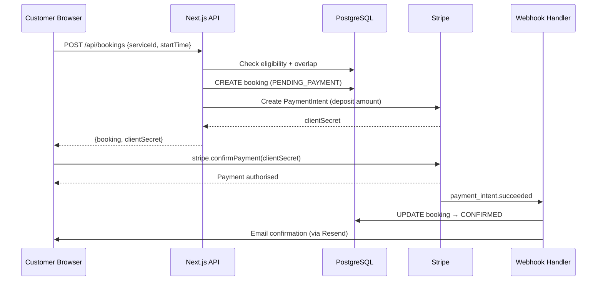
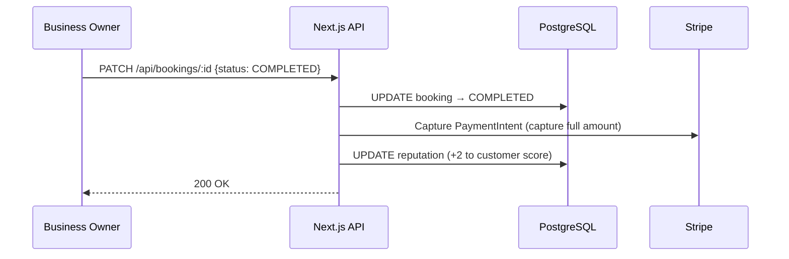
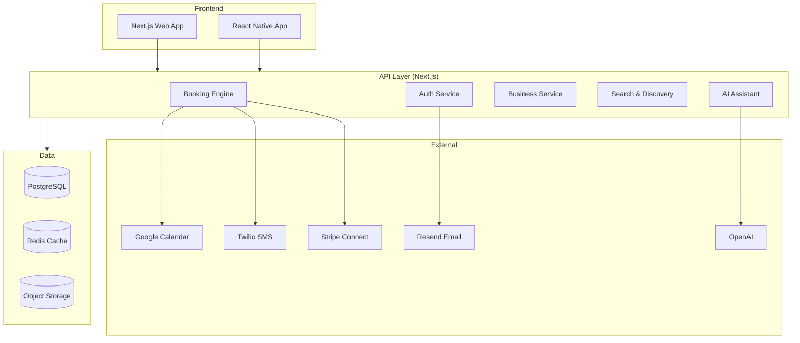

# Ares Booking Platform — Architecture

## Current MVP (Live Now)

A single-tenant appointment booking system. One verified business, one storefront, multi-customer.

### High-Level Components

```
Browser (React/Next.js)
  │
  ├── / (index)           → BookingCalendar + Stripe Elements
  ├── /dashboard          → BusinessDashboard (owner view)
  ├── /business/setup     → Services / Availability / Policy management
  ├── /admin              → Platform stats + disputes
  └── /admin/disputes     → Dispute resolution
        │
        ▼ HTTPS
Next.js API Routes (Node.js / Vercel Serverless)
  │
  ├── /api/auth/[...nextauth]   ← NextAuth (Email magic-link)
  ├── /api/bookings             ← Core booking CRUD
  ├── /api/availability         ← Slot generation
  ├── /api/business/[id]/*      ← Business management
  ├── /api/admin/*              ← Admin panel APIs
  ├── /api/chat                 ← OpenAI assistant
  ├── /api/webhooks/stripe      ← Stripe event handler
  └── /api/payments/intent      ← Stripe PaymentIntent retry
        │
        ├── Prisma ORM ──────→ PostgreSQL (Supabase)
        ├── Stripe SDK ──────→ Stripe API
        ├── OpenAI SDK ──────→ OpenAI API
        └── Resend SDK ──────→ Resend API (optional)
```

### Data Flow: Booking Creation



### Data Flow: Booking Completion



### Database Schema (Key Models)

```
User ──────────┬── Business ──┬── Service
               │              ├── Availability
               │              ├── AvailabilityOverride
               │              └── BusinessPolicy
               │
               └── Booking ───┬── Review
                              ├── Dispute
                              └── (paymentId → Stripe)

ReputationScore (1:1 with User)
NotificationLog
AuditLog
```

### Booking Status State Machine

```
PENDING_PAYMENT
     │
     ├─(payment succeeds, AUTO_CONFIRM)──→ CONFIRMED
     ├─(payment succeeds, MANUAL)─────→ PENDING ──→ CONFIRMED
     ├─(payment fails)────────────────→ (deleted / left in PENDING_PAYMENT)
     └─(cancelled before payment)─────→ CANCELLED_BY_USER

CONFIRMED
     ├─(customer cancels)──→ CANCELLED_BY_USER  (→ refund)
     ├─(business cancels)──→ CANCELLED_BY_BUSINESS (→ full refund)
     ├─(service delivered)─→ COMPLETED           (→ capture deposit)
     ├─(no-show)───────────→ NO_SHOW             (→ charge no-show fee)
     └─(dispute raised)────→ DISPUTED

DISPUTED
     ├─(resolved for customer)──→ REFUNDED
     └─(resolved for business)──→ COMPLETED
```

### Trust & Reputation

Reputation scores range 0–100 (default: 100).

| Event | Score Delta |
|---|---|
| Booking completed | +2 |
| No-show | -20 |
| Late cancellation | -10 |
| Dispute lost (user) | -5 |
| Dispute won (user) | +5 |

- Score < 20: hard block from new bookings
- Score 20–49: flagged for admin review
- Score ≥ 50: unrestricted

---

## Target Architecture (Future Marketplace)

Multi-tenant marketplace where many businesses onboard independently.

### Key Additions

- **Business onboarding flow**: self-serve registration, verification queue, Stripe Connect for payouts
- **Multi-staff scheduling**: staff profiles, per-staff availability, assignment at booking time
- **SMS notifications**: Twilio integration wired to the `phone` field already in the User model
- **Calendar sync**: Google Calendar / iCal export for both customers and businesses
- **Search & discovery**: business directory with categories, location filtering, reviews aggregation
- **Subscription billing**: recurring appointments with Stripe Subscriptions
- **Mobile apps**: React Native sharing the same API layer



### Stripe Connect Flow (Future)

Each business connects their Stripe account. Deposits are split:
- Platform fee (e.g. 2%) retained
- Remainder transferred to business on completion
- Refunds issued from platform reserve on cancellation

### Database Additions Required

- `StaffMember` — belongs to Business, has own Availability
- `BusinessVerification` — KYC queue for admin
- `StripeConnectAccount` — per-business connected account ID
- `Subscription` — recurring booking config
- `Category` — business taxonomy for search
